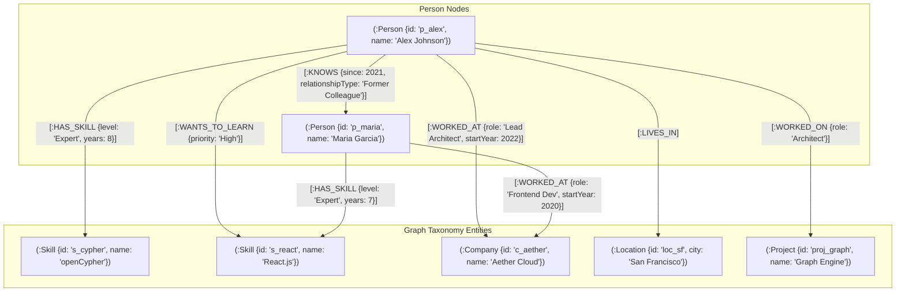
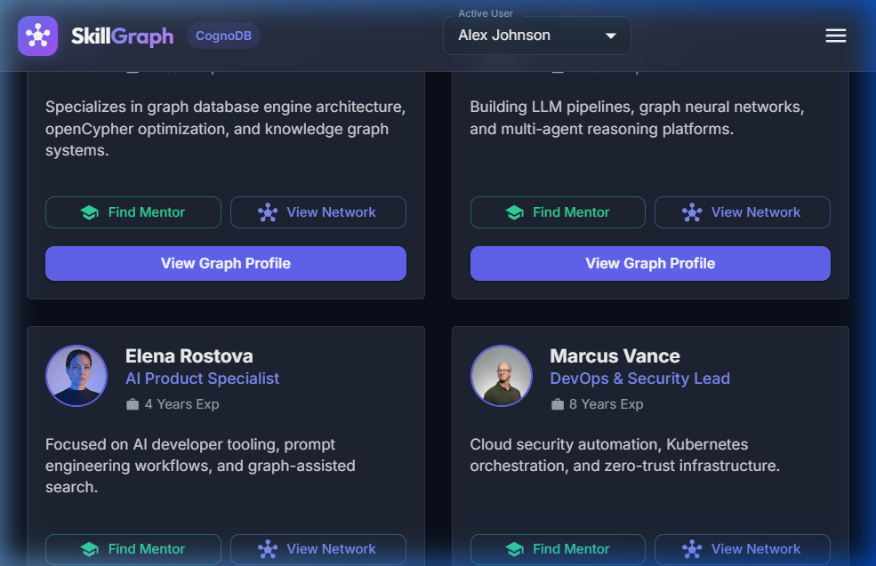
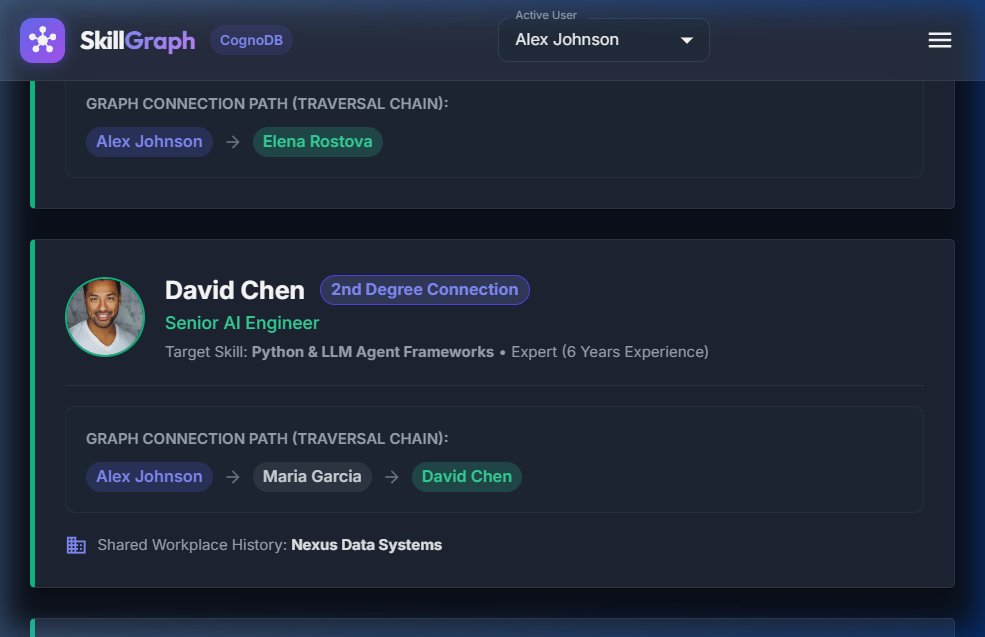
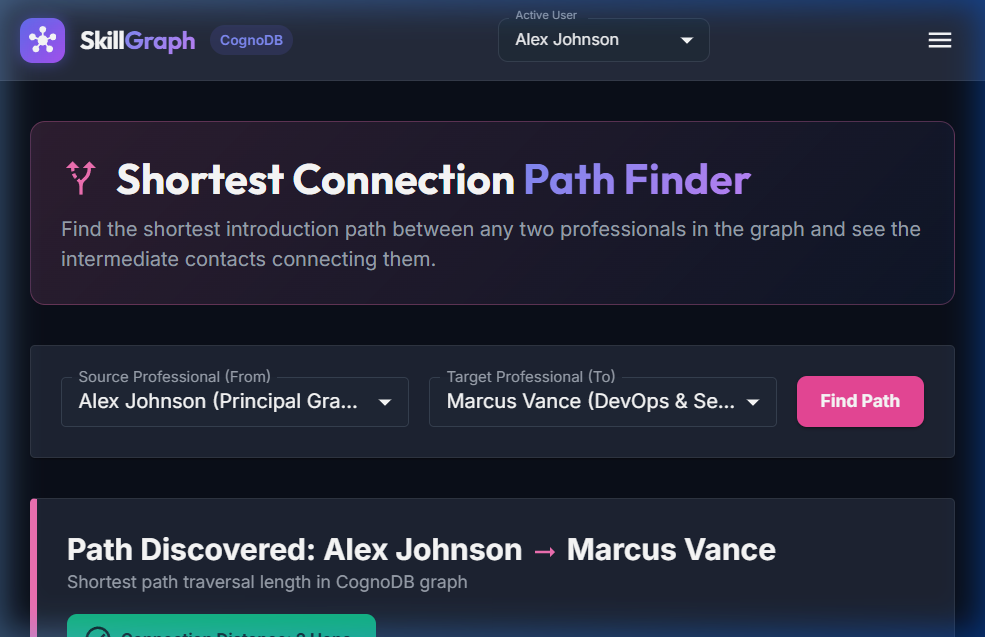
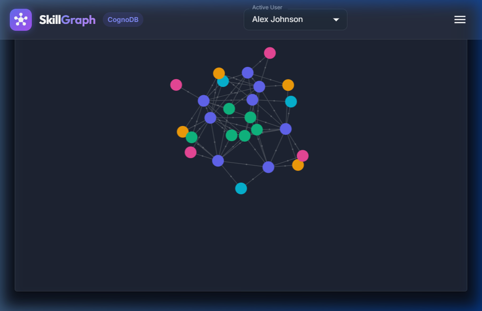

# SkillGraph — Professional Skill & Connection Explorer

SkillGraph is a graph-powered professional networking application built for Wexa AI's take-home assessment. It helps professionals discover people, technical capabilities, shared workplace contexts, and potential skill mentors through multi-hop graph relationship traversal.

The application uses **CognoDB** as the graph database layer over the **Bolt protocol**, queried using **parameterized openCypher** via the official **Neo4j JavaScript driver**, served by a **Node.js / Express.js API**, and presented through an interactive **React + Vite + Material UI (MUI)** interface.

---

## 1. Problem / Use Case

In professional networks, individuals frequently want to learn new technical skills (e.g. *openCypher*, *React.js*, or *Distributed Systems*) but don't know who in their extended network can guide them. 

Relational database models represent user skills and connections through junction tables (`user_skills`, `user_connections`), making variable-hop social searches verbose and difficult to maintain.

**SkillGraph** solves this by modeling professional relationships natively as a graph:

```
(Person: You) -[:KNOWS*1..3]- (Mentor: Person) -[:HAS_SKILL]-> (Skill: Target)
```

By querying 1st, 2nd, and 3rd degree connections along with shared company and project histories, SkillGraph instantly answers:
> *"Who within my 1–3 degree network possesses the skill I want to learn, how do I connect to them, and what shared history do we have?"*

---

## 2. Why a Graph Database?

Choosing **CognoDB** and openCypher for SkillGraph provides distinct modeling and architectural advantages:

### Relationship-Oriented Modeling
Relationships such as `KNOWS`, `HAS_SKILL`, `WANTS_TO_LEARN`, `WORKED_AT`, `LIVES_IN`, and `WORKED_ON` are first-class primitives in the database. They carry properties (`since`, `level`, `years`, `role`) directly on the edge, keeping the domain model intuitive.

### Variable-Depth Traversal
Finding contacts connected within 1 to 3 degrees of separation is expressed natively in openCypher:
```cypher
MATCH path = (p:Person {id: $personId})-[:KNOWS*1..3]-(mentor:Person)
```
In a relational database, variable-length relationship traversal requires complex recursive Common Table Expressions (`WITH RECURSIVE`), cycle prevention arrays, and heavy `JOIN` conditions.

### Native Path Discovery
openCypher treats connection paths as primary return values (`nodes(path)`, `relationships(path)`). Answering *"Connected through whom?"* is built directly into the language without manual array aggregation.

### Structural Flexibility
New node labels (e.g. `Certifications`) or relationship types (e.g. `MENTORED`) can be added without table migrations or schema alters.

> **Architectural Rationale**: The primary advantage of using a graph database here is **expressiveness, modeling clarity, and natural relationship traversal** over complex network topologies.

---

## 3. Architecture

```
                      +----------------------------------+
                      |         React + Vite UI          |
                      |   (MUI, Axios, Canvas Graph)     |
                      +----------------+-----------------+
                                       |
                                       | REST API (JSON)
                                       v
                      +----------------+-----------------+
                      |       Express.js Server          |
                      |   (Controllers & Router)         |
                      +----------------+-----------------+
                                       |
                                       v
                      +----------------+-----------------+
                      |          Graph Service           |
                      |  (Session Pool Lifecycle)        |
                      +----------------+-----------------+
                                       |
                                       v
                      +----------------+-----------------+
                      |    Parameterized openCypher      |
                      |   (cypherQueries Repository)     |
                      +----------------+-----------------+
                                       |
                                       v
                      +----------------+-----------------+
                      |   Official Neo4j JS Driver       |
                      |     (neo4j-driver v5.23)         |
                      +----------------+-----------------+
                                       |
                                       | Bolt Protocol (TLS)
                                       v
                      +----------------+-----------------+
                      |            CognoDB               |
                      |     (Cloud Graph Engine)         |
                      +----------------------------------+
```

### Layer Breakdown:
- **Frontend Layer**: Built with React 18, Vite 5, Material UI (MUI v5), and Axios. Contains zero database logic or credentials.
- **Controller Layer**: Handles HTTP validation, status codes (`200`, `400`, `404`, `500`, `503`), and passes errors to centralized middleware.
- **Service Layer (`graphService.js`)**: Manages session acquisition and guaranteed cleanup (`try ... finally { await session.close() }`), converting Neo4j primitives into clean JS objects.
- **Cypher Repository (`cypherQueries.js`)**: Pure parameterized openCypher query definitions using `$param` bindings.
- **Database Driver (`db.js`)**: Initializes the official `neo4j-driver` using environment variables.

---

## 4. Graph Data Model



### Node Labels & Properties:
- **`Person`**: `id` (String), `name` (String), `title` (String), `email` (String), `experienceYears` (Int), `bio` (String), `avatarUrl` (String)
- **`Skill`**: `id` (String), `name` (String), `category` (String)
- **`Company`**: `id` (String), `name` (String), `industry` (String)
- **`Location`**: `id` (String), `city` (String), `country` (String)
- **`Project`**: `id` (String), `name` (String), `description` (String), `category` (String)

### Relationship Types & Properties:
- **`KNOWS`**: `since` (Int), `relationshipType` (String) — *Traversed bidirectionally to represent mutual connection.*
- **`HAS_SKILL`**: `level` (String), `years` (Int)
- **`WANTS_TO_LEARN`**: `priority` (String)
- **`WORKED_AT`**: `role` (String), `startYear` (Int), `endYear` (Int)
- **`LIVES_IN`**: None
- **`WORKED_ON`**: `role` (String)

---

## 5. Dataset

The seed dataset (`backend/src/seed/seedData.js`) creates a realistic, interconnected network:

### Seeded Node Counts:
- **Person**: 8 professionals
- **Skill**: 6 taxonomy skills
- **Company**: 4 enterprise companies
- **Location**: 3 global tech hubs
- **Project**: 4 engineering projects

### Seeded Relationship Counts:
- **`HAS_SKILL`**: 21 relationships
- **`WORKED_AT`**: 12 relationships
- **`KNOWS`**: 10 mutual connection paths (1st, 2nd, and 3rd degree hops)
- **`WANTS_TO_LEARN`**: 9 learning goals
- **`LIVES_IN`**: 8 location assignments
- **`WORKED_ON`**: 7 project contributions

> **Idempotency**: The seed script uses openCypher `MERGE` clauses throughout, ensuring that re-running `npm run seed` will not create duplicate nodes or relationships.

---

## 6. Main Graph Queries

All Cypher queries are 100% parameterized (`$personId`, `$skillId`, etc.).

### Mentor Recommendation Query (Q8)
Discovers connected mentors possessing a skill a user wants to learn. **Degree counts strictly `KNOWS` hops** (`length(knowsPath)`):
```cypher
MATCH (p:Person {id: $personId})-[w:WANTS_TO_LEARN]->(s:Skill {id: $skillId})
MATCH knowsPath = (p)-[:KNOWS*1..3]-(mentor:Person)
WHERE p <> mentor
MATCH (mentor)-[h:HAS_SKILL]->(s)
OPTIONAL MATCH (p)-[:WORKED_AT]->(c:Company)<-[:WORKED_AT]-(mentor)
OPTIONAL MATCH (p)-[:WORKED_ON]->(proj:Project)<-[:WORKED_ON]-(mentor)
WITH mentor, s, h, knowsPath, c, proj, length(knowsPath) AS degree
RETURN 
  mentor.id AS mentorId,
  mentor.name AS mentorName,
  mentor.title AS mentorTitle,
  s.name AS skillName,
  h.level AS skillLevel,
  h.years AS skillYears,
  degree,
  collect(DISTINCT c.name) AS sharedCompanies,
  collect(DISTINCT proj.name) AS sharedProjects,
  [n IN nodes(knowsPath) | {id: n.id, name: n.name}] AS connectionPath
ORDER BY degree ASC, size(sharedCompanies) DESC, h.years DESC
```

### Shortest Connection Path
```cypher
MATCH (p1:Person {id: $fromPersonId})
MATCH (p2:Person {id: $toPersonId})
OPTIONAL MATCH path = shortestPath((p1)-[:KNOWS*..5]-(p2))
RETURN 
  CASE WHEN path IS NULL THEN null ELSE length(path) END AS distance,
  CASE WHEN path IS NULL THEN [] ELSE [n IN nodes(path) | {id: n.id, name: n.name}] END AS pathNodes,
  CASE WHEN path IS NULL THEN [] ELSE [r IN relationships(path) | {since: r.since, relationshipType: r.relationshipType}] END AS pathEdges
```

---

## 7. API Reference

| Method | Endpoint | Description |
| :--- | :--- | :--- |
| `GET` | `/api/health` | Verifies CognoDB database driver connection status |
| `GET` | `/api/people` | List people with optional `search`, `skill`, `company`, `location` filters |
| `GET` | `/api/people/:personId` | Full person profile (skills, goals, connections, companies, projects) |
| `GET` | `/api/skills` | List taxonomy skills with optional `search` filter |
| `GET` | `/api/skills/:skillId/people` | List professionals possessing a specific skill |
| `GET` | `/api/people/:personId/connections` | Direct 1-hop bidirectional `KNOWS` connections |
| `GET` | `/api/people/:personId/mentors/:skillId` | Q8 Multi-hop mentor recommendations sorted by degree ASC |
| `GET` | `/api/people/:fromPersonId/path/:toPersonId` | Shortest connection path between two professionals |
| `GET` | `/api/people/:personId/network` | People reachable within 1–3 `KNOWS` degrees |
| `GET` | `/api/people/:personId/shared-skills/:otherPersonId` | Skills shared by two connected individuals |
| `GET` | `/api/people/:personId/network-skills` | Common skills across 1–2 degree network |
| `GET` | `/api/graph` | Subgraph node/edge layout data for 2D visualizer canvas |

---

## 8. UI Features

- **People Explorer**: Browse network cards with global search, skill filters, and quick action shortcuts.
- **Person Profile Modal**: View proven skills (`HAS_SKILL`), learning goals (`WANTS_TO_LEARN`), direct connections, companies, and projects.
- **Mentor Finder (Primary Feature)**: Match with mentors in your 1st, 2nd, or 3rd degree network. Displays 1st/2nd/3rd degree chips, visual path chains (`Alex -> Elena -> David -> Maria`), shared companies, and shared projects.
- **Network Explorer**: Explore reachable network nodes filtered by 1, 2, or 3 degrees depth.
- **Connection Path Finder**: Visualize step-by-step introduction chains between any two users with relationship attributes.
- **Skills Taxonomy Explorer**: Browse graph skills and subject-matter experts.
- **Interactive Graph Visualizer**: Live 2D force-directed node-link visualizer with node drag, zoom, pan, camera reset, node label color legends, and detail inspect modals.
- **State Handling**: Skeleton loaders, empty search states, and error banners with retry buttons.

---

## 9. Tech Stack

- **Frontend**: React 18, Vite 5, Material UI (MUI v5), Axios, `force-graph`
- **Backend**: Node.js, Express.js, Official `neo4j-driver` (v5.23), `dotenv`, `cors`
- **Database**: CognoDB (Cloud openCypher engine via Bolt TLS protocol)

---

## 10. Local Setup Instructions

### Prerequisites
- Node.js (v18+ recommended)
- npm (v9+ recommended)
- A CognoDB Cloud Database instance

### Creating a CognoDB Cloud Database Instance
1. Go to the official [CognoDB Cloud Console](https://console.cognodb.com/signup) and create an account.
2. Provision a free C0 CognoDB database instance.
3. Note your connection URI (e.g. `bolt+s://db-xxxxx.databases.cognodb.com`), username (`cognodb`), and database password.

---

## 11. Environment Variables

### Backend Configuration (`backend/.env`):
Create `backend/.env` using `backend/.env.example` as a template:
```env
PORT=5000
COGNODB_URI=bolt+s://db-a6ab4532.databases.cognodb.com
COGNODB_USERNAME=cognodb
COGNODB_PASSWORD=your_actual_cognodb_password_here
```

### Frontend Configuration (`frontend/.env`):
Create `frontend/.env` using `frontend/.env.example` as a template:
```env
VITE_API_URL=http://localhost:5000/api
```

> ⚠️ **Security Notice**: `.env` files contain private credentials and are strictly excluded from Git tracking by `.gitignore`. Never commit `.env` files.

---

## 12. Installation & Quick Start

### Option A: Running with Monorepo Commands (Recommended)

From the project root directory:

```bash
# 1. Install all dependencies for backend & frontend
npm run install:all

# 2. Seed the CognoDB database
npm run seed

# 3. Start backend & frontend concurrently
npm run dev
```

- **Frontend Application**: `http://localhost:5173`
- **Backend REST API**: `http://localhost:5000`

### Option B: Running Manually

```bash
# Backend Setup
cd backend
npm install
npm run seed
npm run dev

# In a separate terminal: Frontend Setup
cd frontend
npm install
npm run dev
```

---

## 13. Seeding the Database

To initialize or reset the CognoDB graph with the dataset, run:

```bash
npm run seed
```

The script is **idempotent** and will create schema constraints, clear existing graph data, populate 25 nodes and 57 edges, and run verification multi-hop queries.

---

## 14. Screenshots

### People Explorer & Network Overview


### Multi-Hop Mentor Finder (Primary Feature)


### Shortest Connection Path Finder


### Interactive 2D Graph Visualizer


---

## 15. Demo & Media

### Live Demo

[Open SkillGraph Application](https://skillgraph-cognodb-dwwc15jq0-anil-kumars-projects-878badc1.vercel.app/)

### Backend API

[Open SkillGraph API](https://skillgraph-cognodb-793v.onrender.com/)

### Video Walkthrough

[Watch the SkillGraph Walkthrough](https://drive.google.com/file/d/10vcN3B76cu2BbulIKRdADr6Kqyq7M_Dn/view?usp=sharing)

### Live Demo Recording

[Watch the Live Demo Recording](https://drive.google.com/file/d/1hd7g9HtGmHozn8JoP2K36GY_VdFWNAKJ/view?usp=sharing)

## 16. Engineering Decisions

- **Parameterized openCypher**: All queries strictly enforce parameter binding (`$param`) to prevent Cypher injection.
- **Session Lifecycle Hygiene**: Neo4j driver sessions are acquired and closed inside `try ... finally` blocks in `graphService.js` to guarantee connection pool cleanup.
- **Decoupled Architecture**: Controllers handle request validation and error propagation; database logic is isolated in the service layer.
- **Code-Splitting**: `GraphVisualizer` is loaded lazily with `React.lazy()` and `Suspense`, optimizing the main bundle size.
- **Idempotency**: Node and edge creation queries use `MERGE` clauses to prevent duplicate graph entities.

---

## 17. Limitations & Future Roadmap

- **Authentication**: Current version focuses on graph navigation; authentication can be added via JWT middleware.
- **Dataset Scaling & Pagination**: Graph visualization limits radius hops for large graphs; server-side pagination can be added for dataset scaling.
- **Recommendation Weighting**: Future iterations can add custom algorithms weighting mentor experience years alongside network distance.
